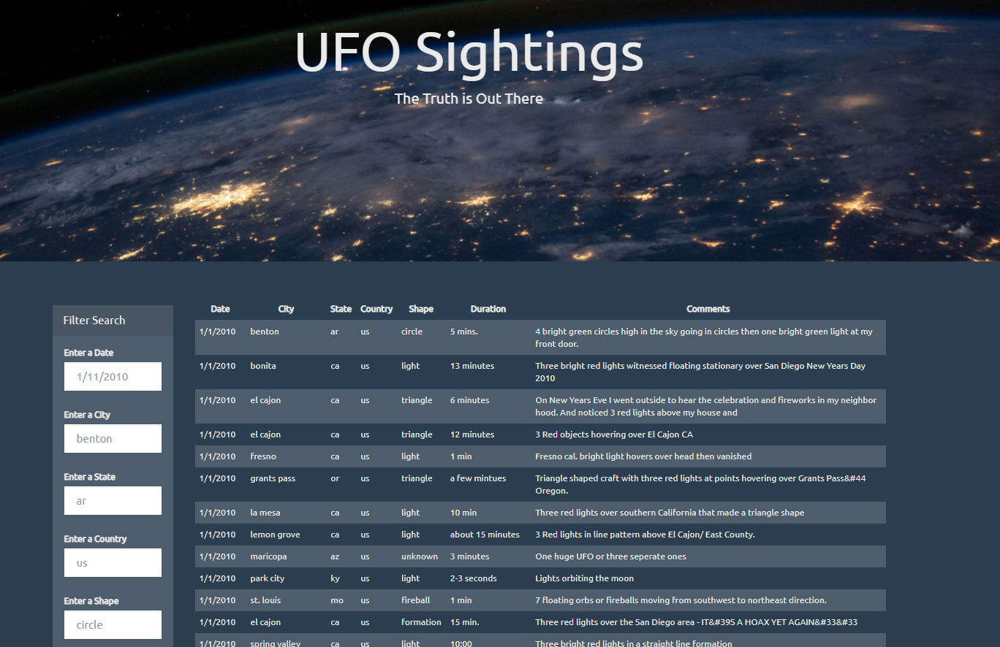

# UFO Sightings Searchsite

# Objective
  Create a simple front-facing application that is populated with UFO Sighting information (supplies in a js file)
  Allow the user to search through the data by supplying keywords 
 
## Quickstart
* Clone the repository
* Python 3.6.12 or later installed
* Navigate into either Level 1 or Level 2 directory --> run "python -m http.server" at the command line
* Open corresponding locally hosted server on web browser

### Overview
This repository contains files/code and images in relation to a UFO sighting webpage, dynamically created with D3 and javascript, primarily

The main file for this repo is app.js, which does the heavy lifting for inserting the objects from data.js into the html via D3. An app.js file exists in both UFO-level-1, and UFO-level-2 directories. These two directories effectively hold the same files, except that in UFO-level-2 the app.js file has been extended to add more filtering options/functionality for the user. In UFO-level-1, the javascripts allow the user to filter by datetime from the webpage index.html; in UFO-level-2 the user can filter by not only date, but city, state, countyr, and shape as well.  

#
Contact: jsurgeon29@gmail.com  
LinkedIn: https://www.linkedin.com/in/jonathansurgeon

## Images

